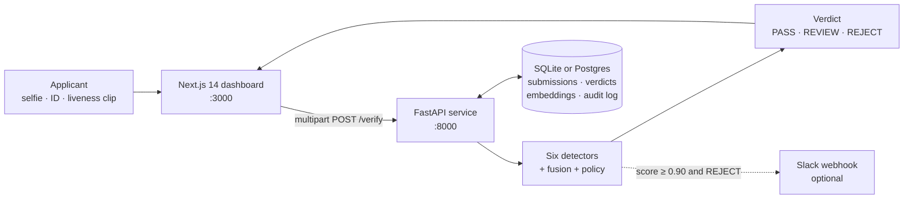
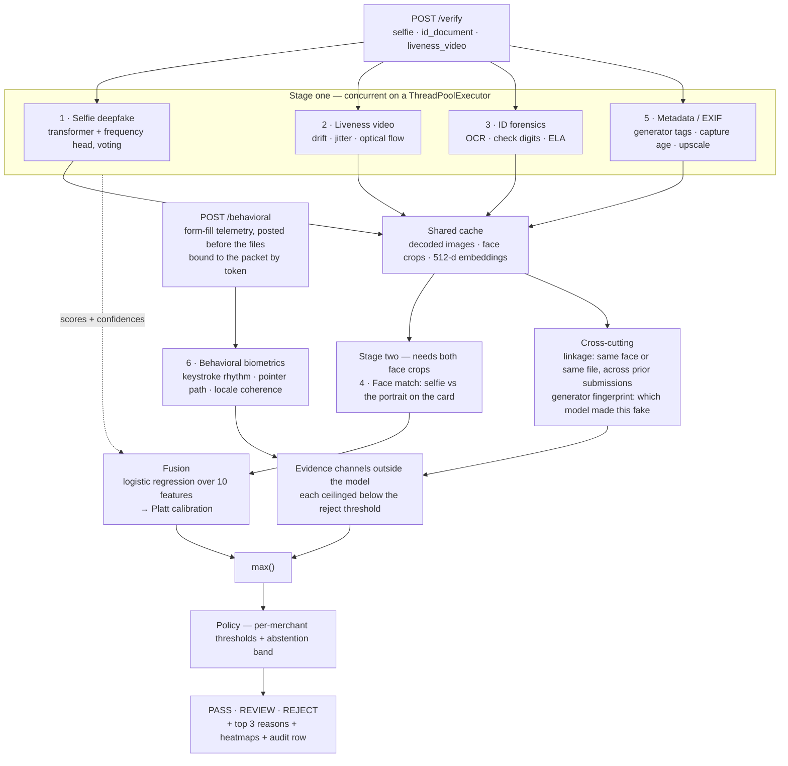
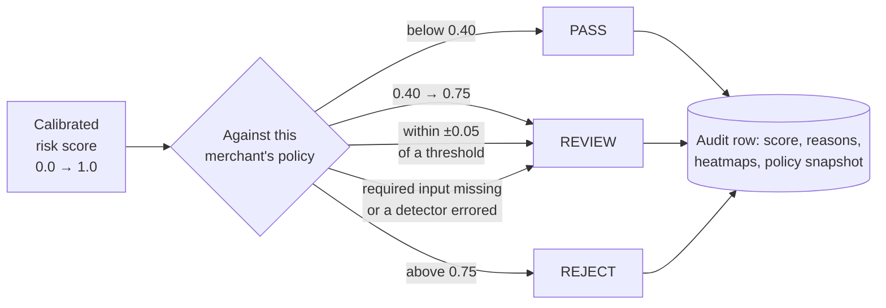
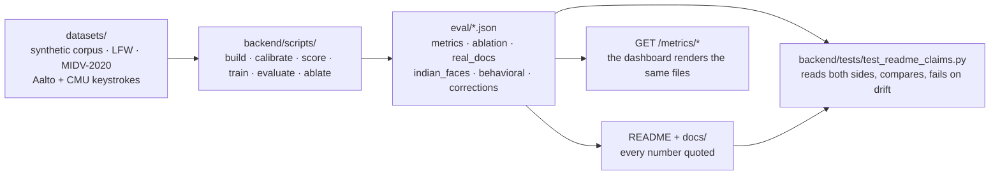

# Verityne

**Deepfake-aware KYC verification — with an audit trail you can argue with.**

[](https://github.com/Abhist17/verityne/actions/workflows/ci.yml)
[](LICENSE)
[](https://www.python.org/)
[](https://nextjs.org/)

Six independent detectors, a calibrated fusion layer, a human-readable
explanation behind every verdict — and **9 documented cases of this project
believing something about itself and then measuring it and being wrong**.
4 are fixed. 3 are still open, including one that
says a detector in this system does not work.

That list is the point. Any vendor can show you a ROC curve; the question a
fraud team actually needs answered is *where does it fail, and how would you
know*. Every correction is generated from the evidence file it cites, so none of
them can drift into being prose — see **[Corrections](docs/corrections.md)**.

```
POST /verify  →  { verdict, risk score, top 3 reasons, heatmaps, per-detector breakdown }
```

Held-out ROC-AUC **0.753** on an identity-disjoint split — a number that used to
read 0.913 until [an ablation found half of it was a label this project had
written into its own files](docs/results.md#what-the-headline-auc-is-actually-made-of).
~2.1 s per packet on GPU. Every number in these documents is reproducible with
`make pipeline`, the real-data numbers with `make real`, and each one is checked
against its evidence file by the test suite.

---

## Start here

**New to the project?** Read this file top to bottom — about ten minutes. It
covers what Verityne is, how to run it, and how a packet becomes a verdict.
Then follow whichever link below matters to you.

| Document | What is in it |
| --- | --- |
| **[Architecture](docs/architecture.md)** | How a packet moves through the system, what the dashboard shows, and where every file lives. |
| **[Corrections](docs/corrections.md)** | The nine beliefs this project held, measured, and lost — and the benchmark that started the habit. |
| **[Results](docs/results.md)** | The held-out evaluation in full, including the ablation that found half the headline was a leak. |
| **[Measured on real data](docs/real-data.md)** | The same detectors on data this project did not generate. Two of the findings are negative. |
| **[Detector 6](docs/behavioral.md)** | Behavioral biometrics: a real keystroke corpus, the feature ablation, and the attack that beats it. |
| **[Fusion & policy](docs/fusion.md)** | How ten features become one score, and how a merchant turns that score into a decision. |
| **[What it proves](docs/evaluation.md)** | What the numbers do and do not establish, with the limitations stated up front. |
| **[API & config](docs/api.md)** | Every endpoint, every environment variable, how to test, and what to do when it breaks. |

---

## The problem

KYC verification was designed when faking an identity meant forging a plastic
card and finding a lookalike. That era ended. A photorealistic face of a person
who does not exist takes about four seconds and costs nothing; face-swap tooling
puts any face onto a "turn your head and blink" liveness video; and matched fake
PAN + selfie + liveness kits sell in Telegram groups for a few hundred rupees.

Every fake merchant that gets through becomes chargeback losses, laundering
exposure, and a regulatory problem for the platform that onboarded them.

---

## Quick start

| | Version | Notes |
| --- | --- | --- |
| Python | 3.12 | 3.11 works; 3.13 is untested |
| Node.js | 20 LTS | for the Next.js dashboard |
| Disk | ~6 GB | ~4 GB of that is the Hugging Face model cache |
| GPU | optional | CUDA 12.4 if present; CPU is the automatic fallback |

```bash
make setup      # venv + npm install  (installs Python deps in two steps — see below)
make pipeline   # corpus → benchmark → calibrate → score → train → evaluate
make real       # calibrate on LFW + measure tamper detection on real documents
make demo       # seed gauntlet + red-team pool, then run both servers
```

Dashboard on <http://localhost:3000>, API docs on <http://localhost:8000/docs>.

Or with Docker:

```bash
cp .env.example .env
docker compose up               # dashboard :3000, API :8000
```

The first run downloads model weights (FaceNet, the deepfake transformer,
EasyOCR) into `storage/models/hf`. Everything after that is offline.
`make pipeline` takes roughly 25–40 minutes on a CUDA GPU and considerably
longer on CPU — most of it is generating the corpus, not training. `make real`
adds about 45 minutes, nearly all of it OCR on 500 documents.

> **Why dependencies install in two steps.** `make setup` runs
> `pip install -r backend/requirements.txt`, then
> `pip install --no-deps -r backend/requirements-nodeps.txt`. The second file
> holds `facenet-pytorch` alone: it pins `torch<2.3`, `numpy<2` and
> `Pillow<10.3` — bounds that no longer hold and that the code does not need — so
> leaving it in the first file makes pip fail with `ResolutionImpossible`.
> Splitting it keeps the honest resolution for everything else.

<details>
<summary><b>Running the pieces individually</b></summary>

```bash
make dataset      # 300 synthetic KYC packets with liveness clips
make benchmark    # measure candidate deepfake checkpoints on our data, pin the winner
make calibrate    # fit the face-match band, spectral head and generator fingerprint
make score        # run all detectors over the corpus, cache raw scores
make train        # fit the fusion layer (train split only)
make evaluate     # held-out report → eval/metrics.json
make ablate       # what each detector is worth; fails if the corpus leaks its labels
make gauntlet     # load 10 genuine + 10 fraudulent demo fixtures
make redteam      # generate unseen attacks for the live red-team button
make backend      # API only, on :8000
make frontend     # dashboard only, on :3000
make test         # backend test suite
make clean        # drop uploads, heatmaps and the database
make fresh        # nuke everything and rebuild end to end
```

```bash
make data-real       # fetch LFW; prints the manual steps for MIDV-2020
make calibrate-face  # fit the identity threshold on LFW's 6,000 real pairs, and apply it
make calibrate-linkage  # fit the linkage threshold as a search, not a pair
make indian-faces    # is the selfie detector reading demography? Indian faces vs FFHQ
make real-docs       # build the tamper set from real captured documents
make eval-real-docs  # score ID forensics on it
make eval-real-video DATA=datasets/faceforensics   # needs gated access
```

```bash
make behavioral      # Detector 6 end to end: fetch keystrokes, drive Chromium, fit, evaluate
make thresholds      # re-fit review/reject on the TRAINING split only
make corrections     # regenerate the audit trail from the evidence files
```
</details>

---

## Architecture

Three processes: a Next.js dashboard, a FastAPI service, and a database. The
dashboard proxies the API through its own origin, so the browser never deals
with CORS and heatmap `` tags just work.



### How one packet becomes a verdict

Stage one runs on a `ThreadPoolExecutor`, not `asyncio.gather`: torch and OpenCV
release the GIL inside their C extensions, so threads genuinely overlap. Async
over CPU-bound work would have bought nothing. All five artifact detectors share
one decoded copy of each image, which is why they are threads and not processes.



Two signals sit outside the fusion model on purpose. **Linkage** is a similarity
search whose false-accept rate compounds with database size, so a face link is
capped below the reject threshold and lands in a human's queue instead — the
uncapped version rejected a genuine applicant on four false matches
([§2b](docs/real-data.md#2b-the-linkage-threshold-was-answering-the-wrong-question)).
**Detector 6** has no labelled corpus inside this repo, so feeding it to the
trained model would be asking about a column it has never seen. A byte-identical
file is exempt from the cap, because it is a fact rather than an inference: two
files share a SHA-256 or they do not.

### Where a score becomes a decision



Verityne would rather say "I am not sure" than flip a coin on someone's
livelihood. Thresholds are per-merchant, live in `backend/verityne/policy.yaml`,
and hot-reload via `POST /admin/reload-policy`. They are **not** constants this
corpus can supply — see
[the thresholds section](docs/results.md#the-thresholds-and-where-they-came-from)
for why fitting them properly made them worse.

### The evidence loop

The reason this project can claim its numbers are honest is that nothing in the
prose is typed by hand. Each evaluation script writes a JSON report; the docs
quote those reports; and the test suite reads both sides and fails if they
disagree.



Full detail, plus the repository layout file by file, is in
**[Architecture](docs/architecture.md)**.

---

## The six detectors

| # | Detector | What it actually looks at |
| --- | --- | --- |
| 1 | **Selfie deepfake** | A pretrained transformer *and* a fitted frequency-domain head. They vote; when they disagree, confidence drops rather than one being picked. Grad-CAM shows which pixels drove the call. |
| 2 | **Liveness video** | Per-frame appearance plus three temporal signals a frame-level model cannot see: identity drift between consecutive frames, head-pose jitter, and optical-flow discontinuity at splice boundaries. |
| 3 | **ID forensics** | OCR with positional confusion repair, then *structural* validation — a PAN's 4th character is a holder-type code and its 5th is the surname initial; Aadhaar carries a Verhoeff check digit. Plus edge-normalised Error Level Analysis, and the printed portrait run through the deepfake classifier. **The ELA component is measured at chance on real captured documents** — see [Measured on real data](docs/real-data.md#measured-on-real-data); the structural checks are deterministic and unaffected. |
| 4 | **Face match** | 512-d FaceNet embeddings, selfie vs the portrait on the card. Flagged in both directions: too low is impersonation, too high means the "selfie" is a copy of the ID photo. The lower bound is **fitted on LFW's 6,000 real pairs** (`eval/face_match_lfw.json`, 98.2% accuracy); the upper bound still comes from the corpus, because LFW contains no documents. |
| 5 | **Metadata / EXIF** | Deterministic provenance: generator tags, editor software, capture-to-submission age, device/resolution consistency, screen re-capture, and an upscale check that asks whether the file carries the detail its resolution claims. |
| 6 | **Behavioral biometrics** | Not an artifact at all — *how the form was filled*. Keystroke dwell and flight timing, key rollover, pointer path straightness, paste events into identity fields, time on form, and device/locale coherence. Fitted on **168,595 real people's typing against real browser automation** — 1.000 held-out AUC, 0.07% of genuine humans flagged, and one attack that defeats it entirely ([§](docs/behavioral.md#detector-6-measured)). |

Beyond the six, two cross-cutting signals: **cross-submission linkage** (one
face onboarding under several names is a ring, and the embeddings are already
computed) and **generator fingerprinting** (which model made this fake — free
labels, because we generated the fakes ourselves).

---

## Results at a glance

Computed on an identity-disjoint held-out split. No face that trained the fusion
layer appears in these numbers.

| | | |
| --- | --- | --- |
| **0.753** | Fusion ROC-AUC, held out | was 0.913 before the leak was removed |
| **9.8%** | Genuine merchants blocked at `REJECT` 0.75 | |
| **59.3%** | Fraud that would be approved at that threshold | the uncomfortable one |
| **~2.1 s** | Per packet, live `POST /verify` on GPU | |

The two numbers worth arguing with are the last two, and the honest reading is
that **where to cut a ranking is an operator's input, not a constant this corpus
can supply**. `GET /metrics/cost-curve` and the sliders on the Metrics page take
fraud loss, merchant lifetime value and abandonment probability and return the
whole curve.

Three findings are still open, and they are stated rather than buried:

- **The selfie detector reads demography.** Its frequency head separates real
  Indian faces from real FFHQ faces at 0.916 AUC — both groups genuine, neither
  fraudulent. It learned the prompt list
  ([§3](docs/real-data.md#3-the-selfie-detector-is-reading-demography)).
- **The selfie detector does not transfer.** Against four generators it was not
  fitted on, every family scores at or below chance
  ([§4](docs/real-data.md#4-the-selfie-detector-on-fakes-we-did-not-generate)).
- **We built the attack that defeats Detector 6.** Replaying a real human's
  recorded keystroke timings scores exactly at chance, and no model of rhythm
  can separate it ([§](docs/behavioral.md#the-attack-that-beats-it-which-we-built-ourselves)).

Full tables — per detector, per attack type, per capture mode, the ablation, the
bias audit and the latency breakdown — are in **[Results](docs/results.md)**, and
the third-party measurements are in
**[Measured on real data](docs/real-data.md)**.

---

## The dashboard

Next.js 14 App Router, seven pages.

| Page | What it does |
| --- | --- |
| **Live Verify** (`/`) | Drag in a selfie, ID and liveness clip; get the verdict, the three reasons, the heatmaps and the per-detector breakdown. Also collects the form-fill telemetry Detector 6 reads, and says on screen that it is doing so. |
| **Gauntlet** (`/gauntlet`) | Runs 10 genuine + 10 fraudulent fixtures over server-sent events, scoring live. |
| **Metrics** (`/metrics`) | The held-out report rendered — ROC, per-attack recall, bias audit, Detector 6's evaluation, and the cost-of-friction curve with operator-tunable ₹ sliders. |
| **Corrections** (`/corrections`) | The audit trail: every belief measured and lost, what it cost, and which are still open. Each entry renders the evidence file and path its numbers came from. |
| **Attack Gallery** (`/attacks`) | Rejected submissions grouped by attack pattern, with the evidence that flagged each. |
| **Threat Intelligence** (`/threat`) | Fraud rings as a node-link graph, generator-fingerprint mix, attack-pattern counts and a live feed. Clicking a node filters the feed to that cluster. |
| **Review Queue** (`/review`) | Human-in-the-loop: everything that abstained, with accept/reject and an audit note. Tracks how often analysts agree with the model. |

---

## Ethics

**No real citizen's identity document is used anywhere in this project.** Every
card in the synthetic corpus is generated by `backend/scripts/idcards.py` from
fictional names and structurally-valid-but-unissued numbers. The real-document
track uses MIDV-2020, whose documents carry *artificially generated* identities
and portraits precisely so the dataset could be published — what is real about
them is the printing and the capture, which is the part that matters here. Real
faces come from FFHQ and LFW, both public research datasets; synthetic faces are
generated locally.

The research datasets are fetched from their sources, never vendored into this
repository. Celeb-DF in particular is licensed to a named requester, so
redistributing it here would not be ours to do.

Verityne never rejects unilaterally at low confidence — the abstention band
exists so borderline cases reach a human. Audit-log retention is configurable
per merchant, and every verdict is stored with the evidence that produced it,
because "the model said so" is not an acceptable answer to a merchant who was
blocked.

## Deliberately not built

Real multi-tenant auth, payment-provider integration, training a deepfake model
from scratch, a mobile SDK, multi-script OCR beyond English, and UIDAI biometric
integration (regulated, months of paperwork). Scope discipline, not oversight.

---

## License

MIT — see [LICENSE](LICENSE).
